# Workwize

A task management app provides users with a centralized platform to plan, organize, and monitor their tasks and projects, whether they are personal or professional. It aims to streamline workflows, enhance productivity, and ensure that nothing falls through the cracks. Users can create tasks, assign them to team members if applicable, set deadlines, track progress, and collaborate seamlessly.

 Table of Contents

  
* [Key Features](#key-features)
* [Benefits](#benefits-of-a-full-stack-web-application)
* [Database Diagram](#database-diagram)
* [Tech Stack](#tech-stack)
* [Pictures of the Application](#pictures-of-the-application)
* [Contributors](#contributors)
  

## Key Features
- **Task Creation:** Users can easily create new tasks, specifying details such as title, description, due date, priority level, tags, and attachments.
- **Task Organization**: Tasks can be organized into teams, projects, categories, or lists, allowing users to categorize and group related tasks together for better clarity and organization.
- **Priority Management:** Users can assign priority levels to tasks to indicate their importance or urgency, helping them focus on what needs immediate attention.
- **Deadline Tracking:** The app allows users to set deadlines for tasks and sends reminders or notifications to ensure timely completion.
- **Collaboration Tools:** For team-based projects, the app facilitates collaboration by enabling users to assign tasks to team members, comment on tasks, share files, and track progress collectively.
- **Progress Monitoring:** Users can track the progress of their tasks and projects, view status updates, and identify bottlenecks or overdue tasks easily.

## Benefits of a Full-Stack Web Application
- **Organization:** Centralizes tasks for streamlined management.
- **Efficiency:** Optimizes workflows for improved productivity.
- **Collaboration:** Enables seamless teamwork and communication.
- **Deadline Tracking:** Provides timely reminders for task completion.
- **Insight:** Offers clear visibility into task progress.
- **Integration:** Syncs with calendars for seamless scheduling.
- **Flexibility:** Customizes to fit specific project requirements.

## Database Diagram

  

## Tech Stack
- **React**
- **TailwindCSS**
- **Django**
- **PostgreSQL**

## Pictures of the Application

  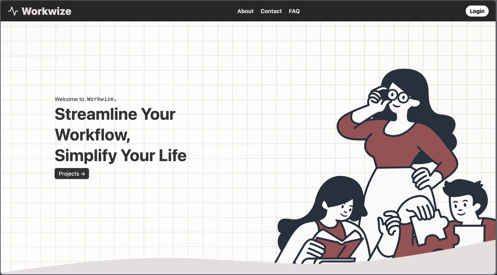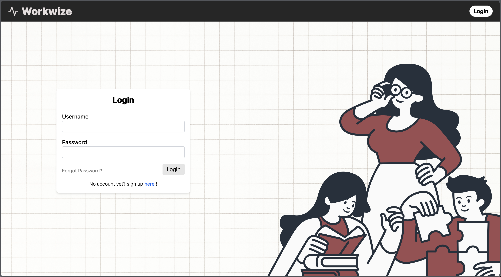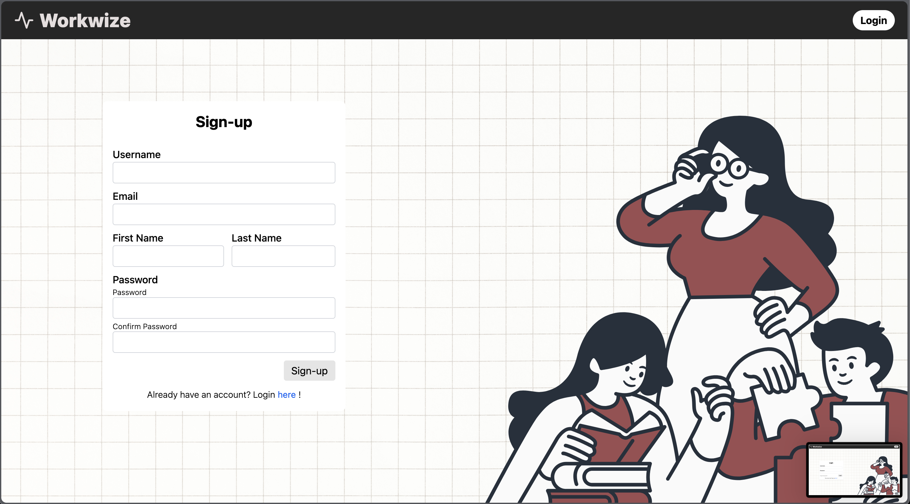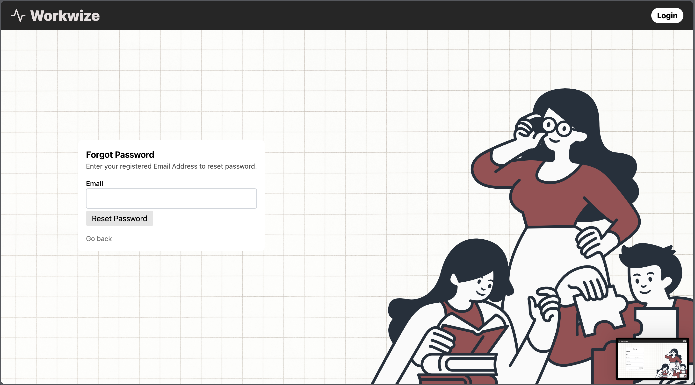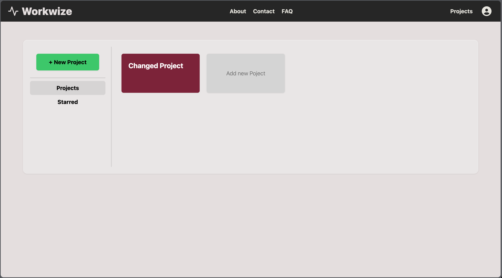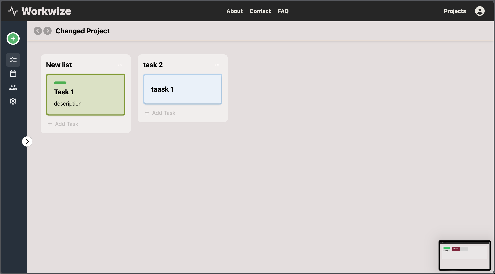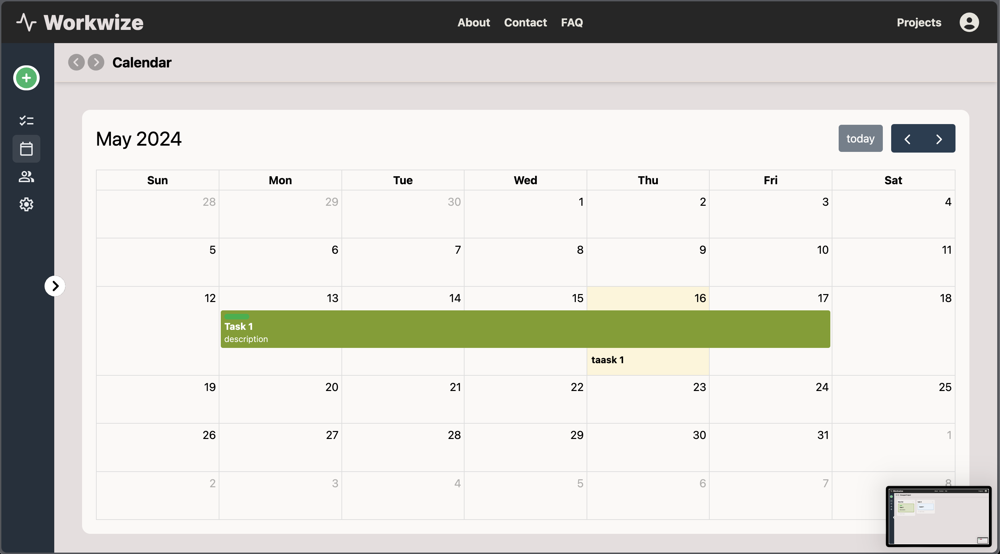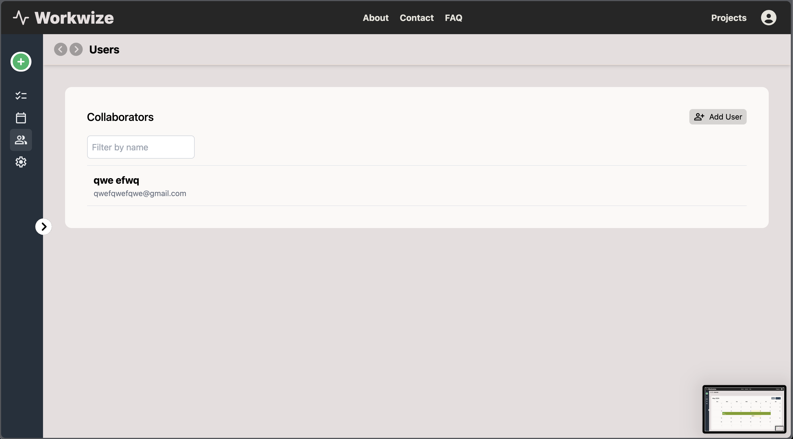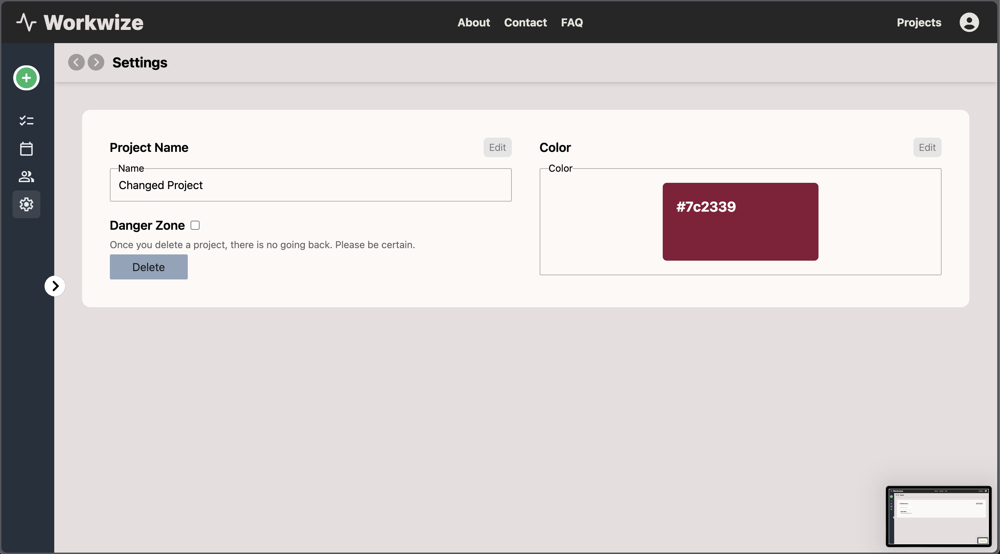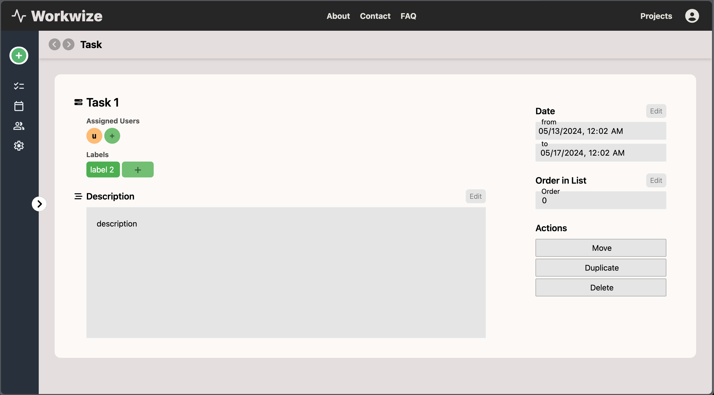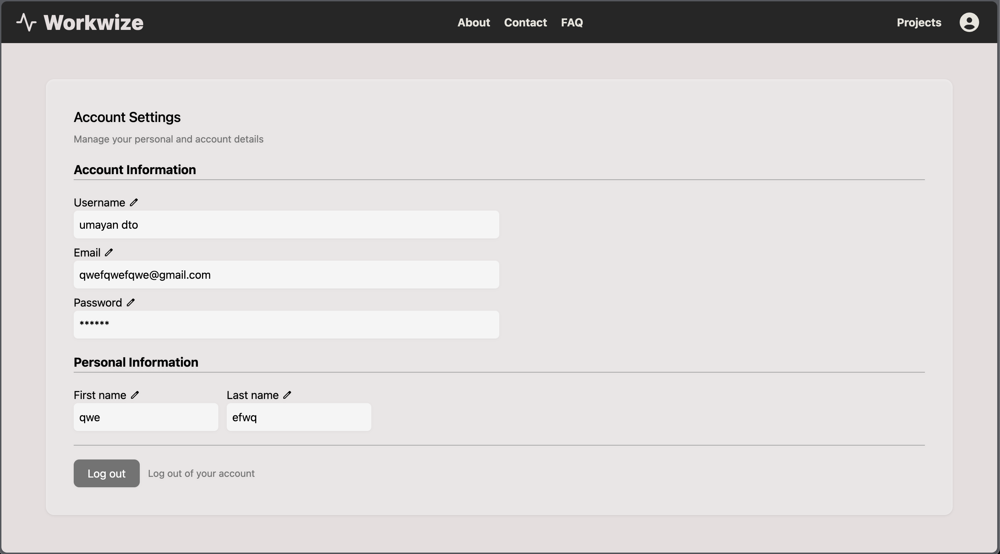

## Contributors

  

